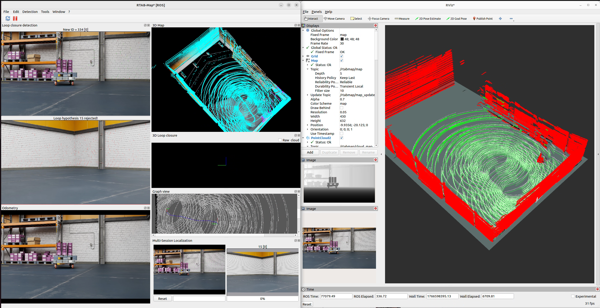
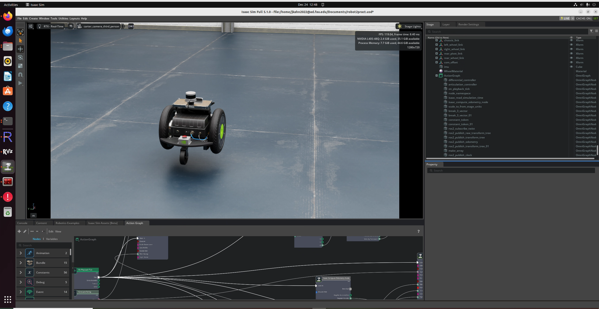

---

# RTAB-Map SLAM with NVIDIA Isaac Sim (Carter Robot)

#### Active Mapping


#### Isaac sim


This repository documents a **working, reproducible setup** for running **RTAB-Map SLAM inside NVIDIA Isaac Sim** using the **Carter robot**, featuring:

* Isaac Sim simulation time (`/clock`)
* RGB-D camera & LiDAR point cloud integration
* Wheel odometry
* Proper TF tree (`map → odom → base_link`)
* RViz visualization
* Nav2 integration (without AMCL)

This guide assumes Isaac Sim and ROS 2 are already installed but **nothing else is configured**.

---

## System Requirements

* **OS:** Ubuntu 20.04 / 22.04
* **ROS 2 Version:** Humble
* **Simulator:** NVIDIA Isaac Sim (2023+)
* **Python:** 3.10 (System Python, **not Conda**)
* **Hardware:** GPU recommended

---

## 1. Install ROS 2 Dependencies

```bash
sudo apt update
sudo apt install -y \
  ros-humble-rtabmap \
  ros-humble-rtabmap-ros \
  ros-humble-navigation2 \
  ros-humble-nav2-bringup \
  ros-humble-tf2-tools \
  ros-humble-rviz2 \
  python3-colcon-common-extensions

```

**Source ROS 2:**

```bash
source /opt/ros/humble/setup.bash
# Add to ~/.bashrc for persistence
echo "source /opt/ros/humble/setup.bash" >> ~/.bashrc

```

---

## 2. Isaac Sim Setup (CRITICAL)

### 2.1 Load the Carter Robot

1. Open **Isaac Sim**.
2. Load the **Carter robot** asset through isaac sim assets and load the scene of your choice (simple warehouse).
3. **Ensure the following are enabled:**
* RGB stereo cameras
* Depth sensing
* LiDAR
* ROS 2 Bridge extension


---

## 3. Isaac Sim Action Graph

RTAB-Map will not work unless Isaac Sim publishes the `/clock` topic to synchronize simulation time.

### 3.1 Required Action Graph Nodes

Add these nodes to your graph:

* `On Playback Tick`
* `Isaac Read Simulation Time`
* `ROS2 Publish Clock`

### 3.2 Required Connections

**Execution Flow:**

* `On Playback Tick (Exec Out)` → `ROS2 Publish Clock (Exec In)`

**Time Data:**

* `Isaac Read Simulation Time (Simulation Time)` → `ROS2 Publish Clock (Time Stamp)`

### 3.3 Node Settings

* **Isaac Read Simulation Time:** Set `Reset On Stop` = `true`
* **ROS2 Publish Clock:** Set `Topic` = `/clock`

---

## 4. Verify Simulation Time & Sensors

Open a terminal (Terminal 1) and verify the clock is running:

```bash
# Target frequency: ~50–60 Hz
ros2 topic hz /clock

```

Check that all sensor topics are active:

```bash
ros2 topic hz /rgb_left
ros2 topic hz /depth_left
ros2 topic hz /camera_info_left
ros2 topic hz /odom
ros2 topic hz /point_cloud

```

---

## 5. Launch RTAB-Map

In a new terminal (Terminal 2), launch the SLAM node:

```bash
ros2 launch rtabmap_launch rtabmap.launch.py \
  namespace:=rtabmap \
  rtabmap_args:="--delete_db_on_start" \
  use_sim_time:=true \
  publish_tf:=true \
  frame_id:=base_link \
  odom_frame_id:=odom \
  map_frame_id:=map \
  visual_odometry:=true \
  subscribe_odom:=true \
  rgbd_sync:=true \
  subscribe_rgbd:=true \
  rgb_topic:=/rgb_left \
  depth_topic:=/depth_left \
  camera_info_topic:=/camera_info_left \
  approx_sync:=true \
  queue_size:=100 \
  qos:=2 \
  subscribe_scan_cloud:=true \
  scan_cloud_topic:=/point_cloud

```

### Sensor Utilization Table

| Sensor | Purpose |
| --- | --- |
| **RGB-D** | Visual features + depth data |
| **LiDAR** | Geometry + ICP (Iterative Closest Point) |
| **Odometry** | Initial motion prior |
| **TF** | `map → odom` published by RTAB-Map |

---

## 6. Visualization & Verification

### Launch RViz (Terminal 3)

```bash
ros2 run rviz2 rviz2 --ros-args -p use_sim_time:=true

```

**Recommended RViz Config:**

* **Fixed Frame:** `map`
* **Displays:** TF, Map (`/rtabmap/map`), PointCloud2 (`/rtabmap/cloud_map`), RobotModel.

### TF Verification (Terminal 4)

Ensure the transforms are being broadcast correctly:

```bash
ros2 run tf2_ros tf2_echo map odom --ros-args -p use_sim_time:=true
ros2 run tf2_ros tf2_echo odom base_link --ros-args -p use_sim_time:=true

```

---

## 7. Operational Best Practices

### Mapping Strategy

* **Drive slowly:** High speeds cause motion blur in cameras.
* **Smooth Inputs:** Avoid jerky teleoperation or rapid direction changes.
* **Loop Closure:** Intentionally revisit known areas to correct drift.
* **Completion:** Stop the node once the environment is fully covered to prevent database bloat.

### Saving the Map

RTAB-Map saves its database automatically on shutdown. To manually trigger a backup:

```bash
ros2 service call /rtabmap/rtabmap/backup std_srvs/srv/Empty {}

```

> **Database Path:** `~/.ros/rtabmap.db`

---

## 8. Nav2 Integration

When using RTAB-Map, it replaces the traditional `map_server` and `amcl` nodes.

**Launch Nav2:**

```bash
ros2 launch nav2_bringup navigation_launch.py \
  use_sim_time:=true \
  params_file:=~/nav2_rtabmap.yaml

```

**Key Parameters in `nav2_rtabmap.yaml`:**

* `StaticLayer` must subscribe to `/rtabmap/map`.
* Disable `AMCL`.
* Set `allow_unknown: true`.
* Reduce the inflation radius for narrow passages.

---

## 9. Mapping vs. Localization

* **Mapping Mode:** Use the argument `--delete_db_on_start` to create a new map.
* **Localization Mode:** Remove the `--delete_db_on_start` argument. RTAB-Map will load the existing database and localize the robot within the saved environment.

---

## 10. Known Limitations

* **IMU Fusion:** No true IMU fusion is configured by default.
* **Physics Noise:** The Carter robot's "rocking" motion can occasionally distort depth maps.
* **Better Alternatives:** For production SLAM, consider platforms with IMU-equipped differential drives or Ackermann steering with suspension.

---
